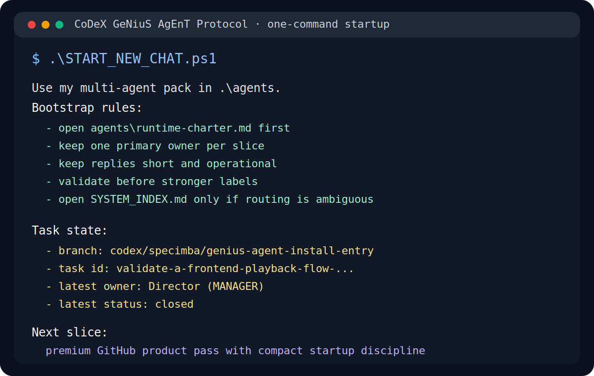
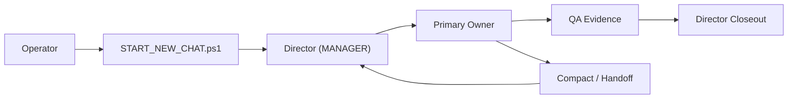
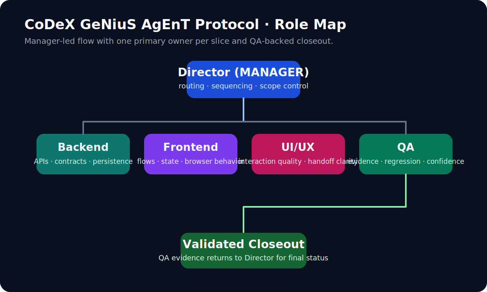

# CoDeX GeNiuS AgEnT Protocol

**Codex-optimized multi-agent operating pack for serious software work.**


This repo is not a generic prompt collection.

It is an operating system for Codex work: one manager-led chain, one primary owner per slice, compact restarts, bounded handoffs, and validation that produces evidence instead of vibes.

---

## What It Solves

Most long-running agent work gets worse as it goes:

- startup instructions sprawl
- roles blur together
- restarts lose state
- “looks good” replaces proof
- context becomes the bottleneck

This pack is built to reverse that trend.

It gives you a disciplined chain:

`Operator -> Director (MANAGER) -> specialist owner -> QA -> Director`

That means:

- clearer routing
- lighter restarts
- cleaner execution slices
- stronger validation
- less dependence on thread memory

---

## Why This Pack Feels Different

| Concern | Typical Prompt Pack | CoDeX GeNiuS AgEnT Protocol |
| --- | --- | --- |
| Startup | Re-explain the system in every thread | One-command bootstrap with compact task state |
| Ownership | Several roles overlap loosely | One primary owner per slice |
| Memory | Thread history becomes the memory layer | Repo files and task-scoped handoffs carry state |
| Confidence | Confidence is mostly narrative | QA, smoke tests, review packets, validation helpers |
| Scale | More complexity means more prompt weight | Runtime charter first, broad docs only on demand |

---

## Quick Start

Verify the pack:

```powershell
.\agents\smoke-test-pack.ps1
```

Start a new compact conversation:

```powershell
.\START_NEW_CHAT.ps1
```

Generate a Director prompt directly:

```powershell
.\agents\use-agent.ps1 director
```

Start a managed task with routing and ledger tracking:

```powershell
.\agents\start-managed-task.ps1 -Task "Investigate and deliver the feature"
```

---

## One-Command Startup

The intended entry is:

```powershell
.\START_NEW_CHAT.ps1
```



That command emits a compact handoff prompt containing:

- the minimum runtime rules
- the current branch
- the latest task state
- the next slice
- fallback guidance only when broader routing is actually needed

Example shape:

```text
Use my multi-agent pack in ...\agents.

Bootstrap rules:
- open ...\agents\runtime-charter.md first
- keep one primary owner per slice
- keep replies short and operational
- validate before stronger labels
- open SYSTEM_INDEX.md only if routing is ambiguous

Task state:
- branch: [current branch]
- task id: [latest task]
- latest owner: [owner]
- latest status: [status]

Next slice:
[next step]
```

If you need manual briefing prompts for a fresh reader or Director, use:

- [`agents/startup-prompts.md`](agents/startup-prompts.md)

---

## Workflow At A Glance





---

## The Pack

### Roles

- `Director (MANAGER)`: routing, sequencing, scope control, final integration
- `Backend Engineer`: APIs, persistence, contracts, jobs, backend debugging
- `Frontend Engineer`: UI flows, components, state, browser behavior, accessibility
- `UI/UX Designer`: interaction quality, hierarchy, flow clarity, handoff guidance
- `QA Engineer`: reproductions, regression coverage, evidence, release confidence

### Core Files

- [`START_NEW_CHAT.ps1`](START_NEW_CHAT.ps1): one-command compact restart
- [`THREAD_BOOTSTRAP.md`](THREAD_BOOTSTRAP.md): minimal startup rule for fresh conversations
- [`SYSTEM_INDEX.md`](SYSTEM_INDEX.md): full internal reference map
- [`agents/runtime-charter.md`](agents/runtime-charter.md): minimum runtime contract
- [`agents/new-thread-handoff.ps1`](agents/new-thread-handoff.ps1): task-scoped handoff generator
- [`agents/startup-prompts.md`](agents/startup-prompts.md): compact prompts for reader agents

---

## Repo Structure

- [`agents/`](agents): prompts, startup helpers, task control, validation scripts
- [`plans/`](plans): architecture notes, current-state program docs, optimization discipline
- [`profiles/`](profiles): determinism presets for repeatable validation
- [`golden/`](golden): bounded seed data for smoke and proof checks
- `runs/`: runtime state and archived validation artifacts
- `dist/`: generated release artifacts when packaging is used

---

## Working Style

- default to `Director (MANAGER)` when the task is cross-functional or unclear
- keep exactly one primary owner per slice
- use repo files as memory instead of re-summarizing the whole thread
- prefer the cheapest competent model tier
- escalate only when the cheaper pass stops producing progress
- use QA for evidence, not reassurance

---

## Best For

- long-running Codex tasks that need clean restarts
- software delivery work with real routing and proof needs
- operators who want a reusable pack instead of ad hoc prompts
- teams that care about ownership, validation, and low-context execution

## Not For

- casual one-off prompting
- maximal parallelism with loose coordination
- roleplay-heavy agent setups
- projects where generated artifacts are meant to remain the main repo surface

---

## Validation

The pack includes:

- prompt and workflow smoke tests
- bounded review packet generation
- validation artifact helpers
- task ledger summaries and snapshots
- determinism profiles

Primary verification command:

```powershell
.\agents\smoke-test-pack.ps1
```

Release summary:

- [`RELEASE_NOTES.md`](RELEASE_NOTES.md)

---

## Source Of Truth

Authoritative by default:

- `agents/`
- `plans/`
- root startup and policy files

Generated or runtime-only by default:

- `dist/`
- `runs/`
- `temp_extract_*`
- caches

---

## Philosophy

The goal is not to sound more agentic.

The goal is to make Codex work feel:

- tighter
- more recoverable
- easier to trust
- cheaper to run
- less dependent on thread history

---

## Contributing

Use [`CONTRIBUTING.md`](CONTRIBUTING.md) for contribution guidance.

Good changes keep the pack:

- clearer
- cheaper to run
- easier to route
- easier to validate

---

## Reference Map

For the full internal system map, use:

- [`SYSTEM_INDEX.md`](SYSTEM_INDEX.md)
